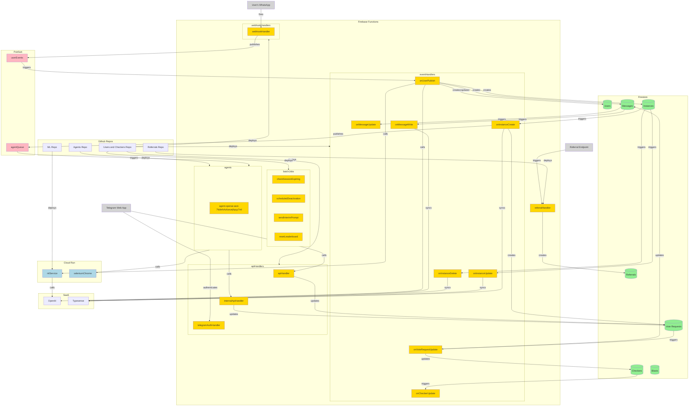

## Repository Structure

We have 5 main repositories for all the codes in CheckMate. In the architecture diagram below, these are at the top, in light grey.

- User and Checkers Product Repository (this one)
  - Handles WhatsApp bot, Telegram bot, and Telegram WebApp interactions for both users and checkers
- [ML Repository](https://github.com/bettersg/checkmate-ml)
  - Handles the OCR of image messages and the auto-categorisation of messages
- [Agents Repository](https://github.com/bettersg/checkmate-agents)
  - Handles the GenAI agent stuff
- [Referrals Repository](https://github.com/bettersg/checkmate-referrals)
  - Handles referral links on the ref.checkmate.sg subdomain
- [Website Repository](https://github.com/bettersg/checkmate-website)
  - Basically the [website](https://checkmate.sg)

## Architecture

Project is deployed on Google Cloud. Cloud Architecture comprises

- Firebase Functions (Orange below)
- Firestore (Green Below)
- Cloud Run (Blue Below)
  - Cloud run is used for services that take too long to cold start
- Cloud Pub/Sub (Pink Below)

These SaaS are also being used in the product.

- OpenAI
  - Used for GenAI features
- Typesense
  - Used as vector DB and search engine

Finally, there are 3 main user interfaces, these are colored in dark grey.

- WhatsApp number/bot for users
- Telegram webapp for checkers
- Web endpoint for referrals

See below diagram for how the elements of the cloud architecture work together:



## Data

The primary data store is Firestore, which is a noSQL db. The entity-relationship diagram below shows the logical relation between various data entities in our application, but since this is a noSQL db, how each entity and relationship is implemented differs.

### Definitions

- message: Top-level collection, called `messages`. Basically a group of instances with the same/similar contents.
- instance: Subcollection under each Message, called `instances`. An instance refers to a particular WhatsApp message sent in by a user.
- voteRequest: Subcollection under each Messaage, called `voteRequests`. A voteRequest represents a request to the checkers to vote on a message.
- checker: Top-level collection, called `checkers`
- user: Top-level collection, called `users`
- blast: Top-level collection, called `blasts`
- userBlast: A Subcollection under each `blast`, where relationship to user is implement as the document ID, which is the user's ID (a.k.a WhatsApp number). Basically tracks a blast received by a user.
- customReply: Map (a.k.a object) under each message, called `customReply`. Relationship to checker implement by `DocumentReference` field `lastUpdatedBy`. Basically tracks details of a custom reply, which overrides the generic category-based response if it is present.
- closestMatch: Map (a.k.a object) under each instance called `closestMatch`. `DocumentReference` fields `instanceRef` and `parentRef` point to the closest matching instance, and its parent message respectively.
- leaderboardStats: Map (a.k.a object) under each checker, called `leaderBoardStats`. Exists to facilitate tracking and calculation of the leaderboard.
- programData: Map (a.k.a object) under each checker, called `programData`. Details related to the volunteer program.

```mermaid
erDiagram

    message {
        string machineCategory
        boolean isMachineCategorised "whether this message was autocategorised"
        string originalText "text as sent by user"
        string text "pii-stripped text. For text, shows the latest iteration of the instance"
        string caption "Latest caption for image, if applicable"
        timestamp firstTimestamp "Timestamp of first instance"
        timestamp lastTimestamp "Timestamp of latest instance"
        timestamp lastRefreshedTimestamp "Timestamp where details were last updated"
        boolean isPollStarted "Whether or not a voting poll has been started for this message"
        boolean isAssessed "Should message be considered assessed and ready for reply"
        timestamp assessedTimestamp "Timestamp of when message was assessed"
        timestamp assessmentExpiry "When assessment should expire, if any, currently not used"
        boolean assessmentExpired "Whether assessment has expired, currently not used"
        boolean isScam
        boolean isIllicit
        boolean isSpam
        boolean isLegitimate
        boolean isUnsure
        boolean isInfo
        boolean isSatire
        boolean isIrrelevant "Should message be considered assessed and ready for reply"
        number truthScore "mean vote score for info votes"
        string primaryCategory "either scam, illicit, irrelevant, spam, legitimate, misleading, untrue, accurate, unsure, or pass"
        number instanceCount "number of instances"
        string rationalisation "genAI created rationalisation of why the message might have ben categorised as such"
    }

    customReply {
        string type "text or image"
        string text
        string caption
        timestamp lastUpdatedTimestamp
    }

    instance {
        string source
        string id "whatsapp message id needed to reply"
        timestamp timestamp "when instance was created"
        string type "text/image"
        string text "text if text message or ocr-extracted text if image message"
        string textHash "md5 hash of text or ocr-extracted text"
        string caption "caption of image, if applicable"
        string captionHash "md5 hash of caption"
        string sender "sender name or number, extracted by OCR, if applicable"
        string imageType "either convo, email, letter, others"
        string ocrVersion "'1' for paddleOCR or '2' for genAI-vertex"
        string from "Sender ID or phone number"
        string subject "letter or email subject"
        string hash "Image hash, for image only"
        string mediaId "Media ID from whatsApp, for image only"
        string mimeType "For image only"
        string storageUrl "Cloud storage URL of image, if applicable"
        boolean isForwarded "Not used for now"
        boolean isFrequentlyForwarded "Not used for now"
        boolean isReplied "System has replied to the citizen with a final assessment"
        boolean isInterimPromptSent "Have we sent an interim prompt"
        boolean isInterimReplySent "Have we sent an interim reply"
        boolean isMeaningfulInterimReplySent "track is a non-unsure meaningful interim reply was sent"
        boolean isRationalisationSent "Has the rationalisation been sent"
        boolean isRationalisationUseful "Is the rationalisation feature useful"
        boolean isReplyForced "track if final reply is forced after 23 hrs"
        boolean isMatched "track if message was matched"
        boolean isReplyImmediate "track if final reply is immediate"
        string replyCategory "scam, illicit, untrue, misleading, accurate, spam, legitimate, irrelevant, irrelevant_auto, unsure"
        timestamp replyTimestamp "time of reply to the sender"
        string matchType "either exact, stripped, similarity or none"
        array embedding "embedding"
        boolean scamShieldConsent "whether users consented to sending the message to scamshield, for scam and illicit only"
        boolean isSatisfactionSurveySent "whether satisfaction survey is sent"
        number satisfactionScore "satisfaction score given by user on NPS survey"
    }

    closestMatch {
        documentReference instanceRef "reference to the instance that was matched"
        documentReference parentRef "reference to the parent message of the instance that was matched"
        string text "text of the closest match"
        string score "similarity score"
        string algorithm "algorithm used to calculate similarity"
    }

    voteRequest {
        string platformId "whatsapp number or telegram Id"
        string platform "whatsapp/telegram/agent"
        boolean hasAgreed "whether person has agreed to vote"
        boolean triggerL2Vote "whether or not a vote should be triggered"
        boolean triggerL2Others "whether or not L2 scam message should be triggered"
        string sentMessageId "message id of the forwarded dubious message to checkers"
        number truthScore "number between 1 and 5. Legacy implementations before release 2.10.0 have the field vote instead on a 0-5 scale, which truthScore replaces"
        string category "scam, illicit, info, satire, legitimate, spam, irrelevant, unsure, pass, or null for not yet voted"
        string reasoning "reasoning for the vote, for GenAI to post"
        timestamp createdTimestamp "time when vote request is sent to user"
        timestamp acceptedTimestamp "time when user first viewed the message"
        timestamp votedTimestamp "time when user has voted"
        boolean isCorrect "whether the vote aligns with majority. Null if majority is unsure or if category is pass"
        number score "score that this vote contributes to the leaderboard"
        number duration "number of minutes taken since start of vote to vote"
    }

    checker {
        string name
        string type "human or ai"
        boolean isActive "whether checker is active and receiving votes from the system"
        boolean isOnboardingComplete "whether onboarding is complete"
        boolean isAdmin "whether checker is an admin"
        string singpassOpenId "Singpass Open ID, not in use"
        string telegramId "telegram ID"
        string whatsappId "whatsapp phone number"
        string tier "tier of checker, either beginner, intermediate, or expert"
        number level "Not used for now, for future gamification"
        number experience "Not used for now, for future gamification"
        number numVoted "Number of messages voted on"
        number numReferred "Number of new users referred"
        number numReported "Number of non-trivial instances sent in sent in"
        number numCorrectVotes "Number of votes that align with majority, for messages that didn't end with unsure"
        number numNonUnsureVotes "Number of votes on messages that didn't end as unsure, for computing accuracy"
        number numVerifiedLinks "Not used for now"
        number voteWeight "Everyone equal for now"
        string preferredPlatform "whatsapp/telegram"
        string getNameMessageId "ID of the message sent to prompt factChecker for their name. Used to track reply on whatsapp."
        timestamp lastVotedTimestamp "When the checker last voted"
    }

    leaderboardStats {
      number numVoted "number of votes cast where the parent message category is not unsure"
      number numCorrectVotes "number of votes that align with majority, for messages that didn't end with unsure"
      number totalTimeTaken "total time taken to vote where the parent message category is not unsure"
      number score "total score"
    }

    programData {
        boolean isOnProgram "Indicates if the user is currently on the program"
        timestamp programStart "Start time of the program, can be null if not started"
        timestamp programEnd "End time of the program, can be null if not completed"
        number numVotesTarget "Target number of messages voted on to complete the program"
        number numReferralTarget "Target number of referrals made to complete the program"
        number numReportTarget "Number of non-trivial messages sent in to complete the program"
        number accuracyTarget "Target accuracy of non-unsure votes"
        number numVotesAtProgramStart "Number of votes checker has made at program start"
        number numReferralsAtProgramStart "Number of referrals checker has made at program start"
        number numReportsAtProgramStart "Number of non-trivial message reports checker has made at program start"
        number numCorrectVotesAtProgramStart "Number of non-unsure correct votes checker has made at program start"
        number numNonUnsureVotesAtProgramStart "Number of non-unsure votes checker has made at program start"
        number numVotesAtProgramEnd "Number of votes checker has made at program end, can be null"
        number numReferralsAtProgramEnd "Number of referrals checker has made at program end, can be null"
        number numReportsAtProgramEnd "Number of non-trivial message reports checker has made at program end, can be null"
        number numCorrectVotesAtProgramEnd "Number of non-unsure correct votes checker has made at program end, can be null"
        number numNonUnsureVotesAtProgramEnd "Number of non-unsure votes checker has made at program end, can be null"
    }

    user {
        number instanceCount "number of instances sent in"
        timestamp lastSent "the last time the user sent an instance"
        timestamp firstMessageReceiptTime "the first time the user sent something into the bot"
        string firstMessageType "either prepopulated, normal, or irrelevant"
        timestamp satisfactionSurveyLastSent "last time satisfaction survey was sent, used to implement cooldown for sending the survey"
        string initialJourney "map mapping out the journey in the first 24 hrs of usage, where key is the timestamp of the step taken"
        string referralId "referral code"
        number referralCount "number of other users referred"
        string utm "map containing utm parameters, source, medium, content, campaign, term"
        string language "en or cn, users preferred language"
        boolean isSubscribedUpdates "whether to blast msgs to this user"
    }

    blasts {
        string type "image or text"
        string text "text or caption if image"
        string storageUrl "image storage url if applicable"
        boolean isActive "the one that should be sent"
        timestamp createdDate "when the blast was created"
        timestamp blastDate "when the blast was sent out"
     }

     userBlast {
        string feedbackCategory "positive, negative or neutral"
        timestamp sentTimestamp "when blast was sent to user"
     }

    message ||--|{ instance: has
    user ||--o{ instance: sends
    message ||--o{ voteRequest: triggers
    checker ||--o{ voteRequest: votes
    instance ||--|| closestMatch: has
    closestMatch ||--|| instance: is
    checker ||--|| leaderboardStats: has
    checker ||--|| programData: has
    message ||--|| customReply: has
    checker ||--|| customReply: composes
    blasts ||--o{ userBlast: has
    user ||--o{ userBlast: provides
```



## Application Flows

The below diagram displays the core flow when users interact with the WhatsApp bot. Each subgraph corresponds to a particular function in functions/src/definitions/, and some nested subgraphs, if there, refer to subfunctions declared within the cloud functions. Some of the functions are also referenced in the above architecture diagram.

Dotted lines refer to asynchronous processes that take longer than the order of seconds. Most of the interfaces between subgraphs/functions are asynchronous in the software engineering sense but they happen near-instantaneously. 

```mermaid
flowchart TB
    classDef human fill:#FFA500
    classDef mlservice fill:#f9f
    classDef agentservice fill:#ffbbff
    classDef dbUpdate fill:#bbffbb
    A[User interacts with WhatsApp bot]:::human
    B[WhatsApp fires webhook to our endpoint]
    subgraph Legend
      Legend1[Human Interface]:::human
      Legend2[Calls ML Service]:::mlservice
      Legend3[Calls Agent Service]:::agentservice
      Legend4[Updates Database]:::dbUpdate
    end
    subgraph webhookHandlers/handler.ts
        C1[Authenticate/Check if correct WhatsApp]
        C2[Put into user or checker queue, depending on WABA phone number ID]
        direction TB
    end
    C3{User/Checker Queue?}
    C4[Deprecated]
    subgraph eventHandlers/onUserPublish.ts
        D1{Is it a message <br> to be checked <br> or some other <br> interaction}
        D2[Handle interaction]
        D3{Text or Image}
        subgraph func newTextInstanceHandler
            D3a1[Autocategorise and check trivial]:::mlservice
            D3a2[Embed and check similarity against database]
            D3a3{Matched?}
            D3a4[Add Message Object]:::dbUpdate
            D3a5[Add Instance Object to Message]:::dbUpdate
            D3a1 --> D3a2
            D3a2 --> D3a3
            D3a3 --No--> D3a4
            D3a4 --> D3a5
            D3a3 --Yes--> D3a5

        end
        subgraph func eventHandlers/newImageInstanceHandler
            D3b1[Download Image]
            D3b2[Check Image Hash against database]
            D3b3{Matched?}
            D3b4[Perform OCR to get text and get category]:::mlservice
            D3b5[Embed text and check similarity against database]
            D3b6{Matched?}
            D3b7[Add Message Object]:::dbUpdate
            D3b8[Add Instance Object To Message]:::dbUpdate
            D3b1 --> D3b2
            D3b2 --> D3b3
            D3b3 --No--> D3b4
            D3b4 --> D3b5
            D3b5 --> D3b6
            D3b6 --No--> D3b7
            D3b6 --Yes--> D3b8
            D3b7 --> D3b8
            D3b3 --Yes--> D3b8
        end
        D1 --Other Interaction--> D2
        D1 --Message to be Checked--> D3
        D3 --Image--> D3b1
        D3 --Text-->D3a1
    end
    subgraph eventHandlers/onInstanceCreate.ts
        direction TB
        E1[Issue reply to user based on current message state - assessed or not]:::human
        E2{Poll previously <br> started?}
        E3[Trigger FactChecking Agents by putting into agents queue]
        E4[Add VoteRequest Object and send Telegram/WhatsApp notification for each active checker]
        E1 --> E2
        E2 --No--> E3
        E3 --> E4
    end
    F[Checker votes on Telegram App]:::human
    F1[Post to api/handlers/patchVoteRequest]
    G[Agent votes]:::agentservice
    subgraph eventHandlers/onVoteRequestUpdate.ts
        direction TB
        H1[Count votes for every category]
        H2[Check against thresholds to determine if message has a predominant category]
        H3[Check against thresholds to determine if a message is considered properly assessed]
        H4[Update Message Object]:::dbUpdate
        H1 --> H2
        H2 --> H3
        H3 --> H4
    end
    subgraph eventHandlers/onMessageUpdate.ts
        direction TB
        I1{isAssessed<br>changed?}
        I2[Trigger GenAI rationalisation of message depending on category]
        I3[Issue reply to user based on current message state]:::human
        I1 --Yes--> I2
        I2 --> I3
    end
    A --> B
    B --> C1
    C1 --> C2
    C2 --> C3
    C3 --user--> eventHandlers/onUserPublish.ts
    C3 --checker--> C4
    D3a5 --> eventHandlers/onInstanceCreate.ts
    D3b8 --> eventHandlers/onInstanceCreate.ts
    E4 -.-> F
    E3 --> G
    F --> F1
    F1 --> eventHandlers/onVoteRequestUpdate.ts
    G --> eventHandlers/onVoteRequestUpdate.ts
    H4 --> I1
```



## Miscellaneous Flows

Beyond the above main flow, there are many sub flows executing in the application

- Update checker score and leaderboard
- Reset leaderboard (batch job monthly)
- Remind checkers who have votes outstanding for more than 72 hrs (batch job daily)
- Send interim replies to qualifying messages (batch job every 20 mins)
- Trigger agents
- Onboard as checkers

We aim to document all these flows eventually, but for now do look at the code to figure these out.

## Local Development & DevOps

We currently have 3 environments, prod, uat, and local. The `/integration-tests` folder contains a 4th mocked environment, SIT, which is run in the CI pipeline. Generally, you'd do most of your feature development on the local dev environment, and in a feature branch. Once the feature branch is ready, make a PR to the `develop` branch. Successful merge into the `develop` branch will trigger a UAT deployment. Successful merge from `develop` into `main` will in turn trigger a prod deployment. All these happen through Github Actions.

### First Time Setup

1. `git clone https://github.com/CheckMateSG/checkMate.git`
2. `cd checkMate`
3. `npm install -g firebase-tools`
    - you may have to install/upgrade your java 
5. `npm run postinstall`
6. run `firebase login --no-localhost` then login with your betterSG email
7. Contact @sarge1989 to set you up with a cloudflare tunnel, and provide your WhatsApp number so the routing can be done to your setup. _Ngrok will not work for this step_, hence the need for this.
8. Contact @sarge1989 to obtain .secret.local and .env.local files, which for now will be sent via password-encrypted zip. Place these two files in the `/functions` directory
9. The phone number to the WhatsApp User bot non-prod number is also in said zip file, in `WhatsApp.txt`. You might want to add it to your contacts for easy access.

### If working on Checkers App

1. Create your own Telegram bot via [botfather](https://t.me/botfather)
2. Replace `TELEGRAM_CHECKER_BOT_TOKEN` in `.secret.local` with the bot token. Note, it is `TELEGRAM_CHECKER_BOT_TOKEN` and not `TELEGRAM_BOT_TOKEN` or `TELEGRAM_WEBHOOK_TOKEN`
3. Go to botfather, navigate to the bot you created, go to "Bot Settings" > "Menu Button". Then add the cloudflare tunnel URL provided by @sarge1989 in step 7 above that routes to your localhost:5000 
4. In .env.local, replace `CHECKER1_TELEGRAM_ID` and `CHECKER1_PHONE_NUMBER` with your own Telegram ID and WhatsApp Phone number respectively. Note that Whatsapp Phone number should include the country code e.g. 6591111111. Telegram ID can be obtained via this [telegram bot](https://t.me/myidbot)

### First time testing (once all above steps are done)

1. Execute the steps in the below section "Each time developing"
2. Go to the chat with the WhatsApp User bot non-prod number and send in /mockup
2. Ensure that the [Firestore Emulator](http://127.0.0.1:4000/firestore) has been populated with some data
3. Send "hi" to the WhatsApp User bot non-prod number. This should trigger the first usage onboarding
4. Send a message such as "Best Fixed Deposit Rates yield 3.75% if you deposit via Syfe (to get institutional fixed deposit rates) (as of June 2024)" into the bot. You'll notice something onUserPublish might take a while, but this should trigger the asynchronous checking flow
   - You can expect to see this on your console:
     ````> {"severity":"INFO","message":"Processing 5"}
     >  {"severity":"INFO","message":"Unable to get Google identity token in lower environments"}
     >  {"severity":"INFO","message":"Unable to get Google identity token in lower environments"}
     >  {"severity":"WARNING","message":"Path doesn't exist in database"}
     i  functions: Beginning execution of "asia-southeast1-onMessageWriteV2"
     >  {"severity":"INFO","message":"Transaction success for messageId wamid.HBgKNjU5M452y262ya53452U0QjZBQkYyNEM5NwA=!"}```
     ````
5. You should see a notification in your Telegram Bot. Go through the voting process.
6. Once done, you should get a reply on the user whatsapp bot.
7. With that, you've basically gone through the end-to-end flow for one message (albeit with only 1 voter in the pool)
   
### Each Time Developing

1. Open 3 shells from in root directory
2. [Shell 1] `make firebase`
3. [Shell 2] `make functions` [hot reload for functions]
4. [Shell 3] `make checkers-app` [hot reload for webapp]
5. If your database is empty, start by sending in `/mockdb` to the WhatsApp non-prod number, which will populate some baseline data in the local emulated firestore database.
6. Firestore Emulator can be visited at http://127.0.0.1:4000/firestore
7. Can start on development. There should be live refreshing on the changes you make

#### Note:
- When shutting down the emulator, proceed in this order.
    - Control-C in Shell 3. Enter "Y" if prompted. Otherwise, pre-existing data may not be saved to local.
    - Close the windows running the Java applications. Otherwise, the port will be used up. 
---

In the event the Makefile doesn't work,

1. Open 3 shells from in root directory
2. [Shell 1] `cd functions`
3. [Shell 1] `npm run build:watch` [hot reload for functions]
4. [Shell 2] `cd checkers-app` [hot reload for webapp]
5. [Shell 2] `npm run build:watch`
6. [Shell 3] `npm run serve`
7. Can start on development

### Useful Resources and links:

- Firebase Console - https://console.firebase.google.com/, login with your bettersg email. Go here to manage the product resources
- Adding subcollections - https://stackoverflow.com/questions/47514419/how-to-add-subcollection-to-a-document-in-firebase-cloud-firestore
- Getting started with firestore and firebasehttps://firebase.google.com/docs/functions/get-started
- WhatsApp send message API documentation - https://developers.facebook.com/docs/whatsapp/cloud-api/guides/send-messages
- WhatsApp webhook object documentation - https://developers.facebook.com/docs/whatsapp/cloud-api/webhooks/components
- Telegram Bot API documentation - https://core.telegram.org/bots/api
