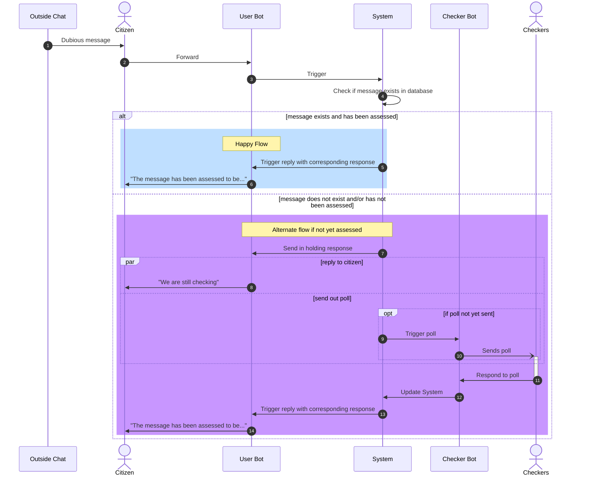

```mermaid
sequenceDiagram
    autonumber
    participant Outside Chat
    actor Citizen
    participant User Bot
    participant System
    participant Checker Bot
    actor Checkers
    Outside Chat->>Citizen: Dubious message
    Citizen->>User Bot: Forward
    User Bot->>System: Trigger
    System->>System: Check if message exists in database
    alt message exists and has been assessed
        rect rgb(191, 223, 255)
        note over User Bot: Happy Flow
        System->> User Bot: Trigger reply with corresponding response
        User Bot->> Citizen: "The message has been assessed to be..."
        end
    else message does not exist and/or has not been assessed
        rect rgb(200, 150, 255)
        note over User Bot,System: Alternate flow if not yet assessed
        System->> User Bot: Send in holding response
        par reply to citizen
            User Bot->> Citizen: "We are still checking"
        and send out poll
            opt if poll not yet sent
                System->> Checker Bot: Trigger poll
                Checker Bot-)+Checkers: Sends poll
            end
        end
        Checkers->> -Checker Bot: Respond to poll
        Checker Bot->> System: Update System
        System->> User Bot: Trigger reply with corresponding response
        User Bot->> Citizen: "The message has been assessed to be..."
        end
    end
```
