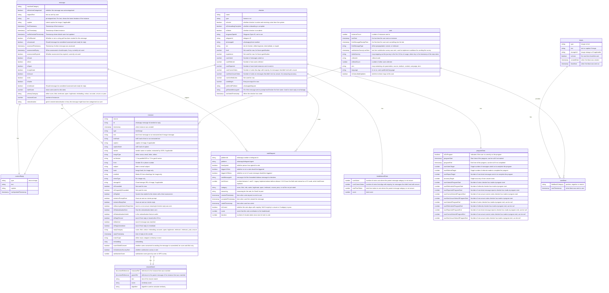

```mermaid
erDiagram

    message {
        string machineCategory
        boolean isMachineCategorised "whether this message was autocategorised"
        string originalText "text as sent by user"
        string text "pii-stripped text. For text, shows the latest iteration of the instance"
        string caption "Latest caption for image, if applicable"
        timestamp firstTimestamp "Timestamp of first instance"
        timestamp lastTimestamp "Timestamp of latest instance"
        timestamp lastRefreshedTimestamp "Timestamp where details were last updated"
        boolean isPollStarted "Whether or not a voting poll has been started for this message"
        boolean isAssessed "Should message be considered assessed and ready for reply"
        timestamp assessedTimestamp "Timestamp of when message was assessed"
        timestamp assessmentExpiry "When assessment should expire, if any, currently not used"
        boolean assessmentExpired "Whether assessment has expired, currently not used"
        boolean isScam 
        boolean isIllicit
        boolean isSpam
        boolean isLegitimate
        boolean isUnsure
        boolean isInfo
        boolean isSatire
        boolean isIrrelevant "Should message be considered assessed and ready for reply"
        number truthScore "mean vote score for info votes"
        string primaryCategory "either scam, illicit, irrelevant, spam, legitimate, misleading, untrue, accurate, unsure, or pass"
        number instanceCount "number of instances"
        string rationalisation "genAI created rationalisation of why the message might have ben categorised as such"
    }

    customReply {
        string type "text or image"
        string text
        string caption
        timestamp lastUpdatedTimestamp
    }

    instance {
        string source
        string id "whatsapp message id needed to reply"
        timestamp timestamp "when instance was created"
        string type "text/image"
        string text "text if text message or ocr-extracted text if image message"
        string textHash "md5 hash of text or ocr-extracted text"
        string caption "caption of image, if applicable"
        string captionHash "md5 hash of caption"
        string sender "sender name or number, extracted by OCR, if applicable"
        string imageType "either convo, email, letter, others"
        string ocrVersion "'1' for paddleOCR or '2' for genAI-vertex"
        string from "Sender ID or phone number"
        string subject "letter or email subject"
        string hash "Image hash, for image only"
        string mediaId "Media ID from whatsApp, for image only"
        string mimeType "For image only"
        string storageUrl "Cloud storage URL of image, if applicable"
        boolean isForwarded "Not used for now"
        boolean isFrequentlyForwarded "Not used for now"
        boolean isReplied "System has replied to the citizen with a final assessment"
        boolean isInterimPromptSent "Have we sent an interim prompt"
        boolean isInterimReplySent "Have we sent an interim reply"
        boolean isMeaningfulInterimReplySent "track is a non-unsure meaningful interim reply was sent"
        boolean isRationalisationSent "Has the rationalisation been sent"
        boolean isRationalisationUseful "Is the rationalisation feature useful"
        boolean isReplyForced "track if final reply is forced after 23 hrs"
        boolean isMatched "track if message was matched"
        boolean isReplyImmediate "track if final reply is immediate"
        string replyCategory "scam, illicit, untrue, misleading, accurate, spam, legitimate, irrelevant, irrelevant_auto, unsure"
        timestamp replyTimestamp "time of reply to the sender"
        string matchType "either exact, stripped, similarity or none"
        array embedding "embedding"
        boolean scamShieldConsent "whether users consented to sending the message to scamshield, for scam and illicit only"
        boolean isSatisfactionSurveySent "whether satisfaction survey is sent"
        number satisfactionScore "satisfaction score given by user on NPS survey"
    }

    closestMatch {
        documentReference instanceRef "reference to the instance that was matched"
        documentReference parentRef "reference to the parent message of the instance that was matched"
        string text "text of the closest match"
        string score "similarity score"
        string algorithm "algorithm used to calculate similarity"
    }

    voteRequest {
        string platformId "whatsapp number or telegram Id"
        string platform "whatsapp/telegram/agent"
        boolean hasAgreed "whether person has agreed to vote"
        boolean triggerL2Vote "whether or not a vote should be triggered"
        boolean triggerL2Others "whether or not L2 scam message should be triggered"
        string sentMessageId "message id of the forwarded dubious message to checkers"
        number truthScore "number between 1 and 5. Legacy implementations before release 2.10.0 have the field vote instead on a 0-5 scale, which truthScore replaces"
        string category "scam, illicit, info, satire, legitimate, spam, irrelevant, unsure, pass, or null for not yet voted"
        string reasoning "reasoning for the vote, for GenAI to post"
        timestamp createdTimestamp "time when vote request is sent to user"
        timestamp acceptedTimestamp "time when user first viewed the message"
        timestamp votedTimestamp "time when user has voted"
        boolean isCorrect "whether the vote aligns with majority. Null if majority is unsure or if category is pass"
        number score "score that this vote contributes to the leaderboard"
        number duration "number of minutes taken since start of vote to vote"
    }

    checker {
        string name
        string type "human or ai"
        boolean isActive "whether checker is active and receiving votes from the system"
        boolean isOnboardingComplete "whether onboarding is complete"
        boolean isAdmin "whether checker is an admin"
        string singpassOpenId "Singpass Open ID, not in use"
        string telegramId "telegram ID"
        string whatsappId "whatsapp phone number"
        string tier "tier of checker, either beginner, intermediate, or expert"
        number level "Not used for now, for future gamification"
        number experience "Not used for now, for future gamification"
        number numVoted "Number of messages voted on"
        number numReferred "Number of new users referred"
        number numReported "Number of non-trivial instances sent in sent in"
        number numCorrectVotes "Number of votes that align with majority, for messages that didn't end with unsure"
        number numNonUnsureVotes "Number of votes on messages that didn't end as unsure, for computing accuracy"
        number numVerifiedLinks "Not used for now"
        number voteWeight "Everyone equal for now"
        string preferredPlatform "whatsapp/telegram"
        string getNameMessageId "ID of the message sent to prompt factChecker for their name. Used to track reply on whatsapp."
        timestamp lastVotedTimestamp "When the checker last voted"
    }

    leaderboardStats {
      number numVoted "number of votes cast where the parent message category is not unsure"
      number numCorrectVotes "number of votes that align with majority, for messages that didn't end with unsure"
      number totalTimeTaken "total time taken to vote where the parent message category is not unsure"
      number score "total score"
    }

    programData {
        boolean isOnProgram "Indicates if the user is currently on the program"
        timestamp programStart "Start time of the program, can be null if not started"
        timestamp programEnd "End time of the program, can be null if not completed"
        number numVotesTarget "Target number of messages voted on to complete the program"
        number numReferralTarget "Target number of referrals made to complete the program"
        number numReportTarget "Number of non-trivial messages sent in to complete the program"
        number accuracyTarget "Target accuracy of non-unsure votes"
        number numVotesAtProgramStart "Number of votes checker has made at program start"
        number numReferralsAtProgramStart "Number of referrals checker has made at program start"
        number numReportsAtProgramStart "Number of non-trivial message reports checker has made at program start"
        number numCorrectVotesAtProgramStart "Number of non-unsure correct votes checker has made at program start"
        number numNonUnsureVotesAtProgramStart "Number of non-unsure votes checker has made at program start"
        number numVotesAtProgramEnd "Number of votes checker has made at program end, can be null"
        number numReferralsAtProgramEnd "Number of referrals checker has made at program end, can be null"
        number numReportsAtProgramEnd "Number of non-trivial message reports checker has made at program end, can be null"
        number numCorrectVotesAtProgramEnd "Number of non-unsure correct votes checker has made at program end, can be null"
        number numNonUnsureVotesAtProgramEnd "Number of non-unsure votes checker has made at program end, can be null"
    }

    user {
        number instanceCount "number of instances sent in"
        timestamp lastSent "the last time the user sent an instance"
        timestamp firstMessageReceiptTime "the first time the user sent something into the bot"
        string firstMessageType "either prepopulated, normal, or irrelevant"
        timestamp satisfactionSurveyLastSent "last time satisfaction survey was sent, used to implement cooldown for sending the survey"
        string initialJourney "map mapping out the journey in the first 24 hrs of usage, where key is the timestamp of the step taken"
        string referralId "referral code"
        number referralCount "number of other users referred"
        string utm "map containing utm parameters, source, medium, content, campaign, term"
        string language "en or cn, users preferred language"
        boolean isSubscribedUpdates "whether to blast msgs to this user"
    }

    blasts {
        string type "image or text"
        string text "text or caption if image"
        string storageUrl "image storage url if applicable"
        boolean isActive "the one that should be sent"
        timestamp createdDate "when the blast was created"
        timestamp blastDate "when the blast was sent out"
     }

     userBlast {
        string feedbackCategory "positive, negative or neutral"
        timestamp sentTimestamp "when blast was sent to user"
     }

    message ||--|{ instance: has
    user ||--o{ instance: sends
    message ||--o{ voteRequest: triggers
    checker ||--o{ voteRequest: votes
    instance ||--|| closestMatch: has
    closestMatch ||--|| instance: is
    checker ||--|| leaderboardStats: has
    checker ||--|| programData: has
    message ||--|| customReply: has
    checker ||--|| customReply: composes
    blasts ||--o{ userBlast: has
    user ||--o{ userBlast: provides
```