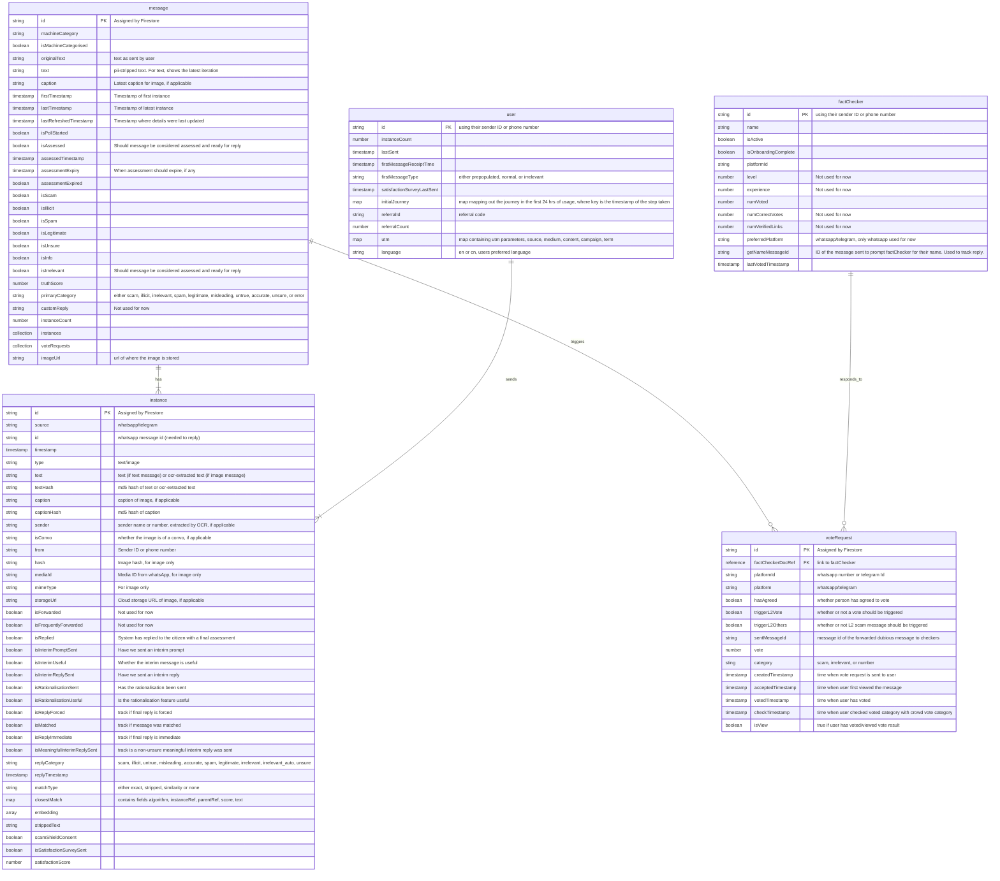

```mermaid
erDiagram

    message {
        string id PK "Assigned by Firestore"
        string machineCategory
        boolean isMachineCategorised
        string originalText "text as sent by user"
        string text "pii-stripped text. For text, shows the latest iteration"
        string caption "Latest caption for image, if applicable"
        timestamp firstTimestamp "Timestamp of first instance"
        timestamp lastTimestamp "Timestamp of latest instance"
        timestamp lastRefreshedTimestamp "Timestamp where details were last updated"
        boolean isPollStarted
        boolean isAssessed "Should message be considered assessed and ready for reply"
    		timestamp assessedTimestamp
        timestamp assessmentExpiry "When assessment should expire, if any"
        boolean assessmentExpired
        boolean isScam
        boolean isIllicit
        boolean isSpam
        boolean isLegitimate
        boolean isUnsure
        boolean isInfo
        boolean isIrrelevant "Should message be considered assessed and ready for reply"
        number truthScore
        string primaryCategory "either scam, illicit, irrelevant, spam, legitimate, misleading, untrue, accurate, unsure, or error"
        string customReply "Not used for now"
        number instanceCount
        collection instances
        collection voteRequests
        string imageUrl "url of where the image is stored"
    }

    instance {
        string id PK "Assigned by Firestore"
        string source "whatsapp/telegram"
        string id "whatsapp message id (needed to reply)"
        timestamp timestamp
        string type "text/image"
        string text "text (if text message) or ocr-extracted text (if image message)"
        string textHash "md5 hash of text or ocr-extracted text"
        string caption "caption of image, if applicable"
        string captionHash "md5 hash of caption"
        string sender "sender name or number, extracted by OCR, if applicable"
        string isConvo "whether the image is of a convo, if applicable"
        string from "Sender ID or phone number"
        string hash "Image hash, for image only"
        string mediaId "Media ID from whatsApp, for image only"
        string mimeType "For image only"
        string storageUrl "Cloud storage URL of image, if applicable"
        boolean isForwarded "Not used for now"
        boolean isFrequentlyForwarded "Not used for now"
        boolean isReplied "System has replied to the citizen with a final assessment"
        boolean isInterimPromptSent "Have we sent an interim prompt"
        boolean isInterimUseful "Whether the interim message is useful"
        boolean isInterimReplySent "Have we sent an interim reply"
        boolean isRationalisationSent "Has the rationalisation been sent"
        boolean isRationalisationUseful "Is the rationalisation feature useful"
        boolean isReplyForced "track if final reply is forced"
        boolean isMatched "track if message was matched"
        boolean isReplyImmediate "track if final reply is immediate"
        boolean isMeaningfulInterimReplySent "track is a non-unsure meaningful interim reply was sent"
        string replyCategory "scam, illicit, untrue, misleading, accurate, spam, legitimate, irrelevant, irrelevant_auto, unsure"
    		timestamp replyTimestamp
        string matchType "either exact, stripped, similarity or none"
        map closestMatch "contains fields algorithm, instanceRef, parentRef, score, text"
        array embedding
        string strippedText
        boolean scamShieldConsent
        boolean isSatisfactionSurveySent
        number satisfactionScore
    }

    voteRequest {
        string id PK "Assigned by Firestore"
        reference factCheckerDocRef FK "link to factChecker"
        string platformId "whatsapp number or telegram Id"
        string platform "whatsapp/telegram"
        boolean hasAgreed "whether person has agreed to vote"
        boolean triggerL2Vote "whether or not a vote should be triggered"
        boolean triggerL2Others "whether or not L2 scam message should be triggered"
        string sentMessageId "message id of the forwarded dubious message to checkers"
        number vote
        sting category "scam, irrelevant, or number"
        timestamp createdTimestamp "time when vote request is sent to user"
        timestamp acceptedTimestamp "time when user first viewed the message"
        timestamp votedTimestamp "time when user has voted"
        timestamp checkTimestamp "time when user checked voted category with crowd vote category"
        boolean isView "true if user has voted/viewed vote result"
    }

    factChecker {
        string id PK "using their sender ID or phone number"
        string name
        boolean isActive
        boolean isOnboardingComplete
        string platformId
        number level "Not used for now"
        number experience "Not used for now"
        number numVoted
        number numCorrectVotes "Not used for now"
        number numVerifiedLinks "Not used for now"
        string preferredPlatform "whatsapp/telegram, only whatsapp used for now"
    		string getNameMessageId "ID of the message sent to prompt factChecker for their name. Used to track reply."
        timestamp lastVotedTimestamp
    }

    	user {
    		string id PK "using their sender ID or phone number"
    		number instanceCount
    		timestamp lastSent
    		timestamp firstMessageReceiptTime
        string firstMessageType "either prepopulated, normal, or irrelevant"
        timestamp satisfactionSurveyLastSent
        map initialJourney "map mapping out the journey in the first 24 hrs of usage, where key is the timestamp of the step taken"
        string referralId "referral code"
        number referralCount
        map utm "map containing utm parameters, source, medium, content, campaign, term"
        string language "en or cn, users preferred language"
    	}

    message ||--|{ instance: has
    user ||--|{ instance: sends
    message ||--o{ voteRequest: triggers
    factChecker ||--o{ voteRequest: responds_to
```
