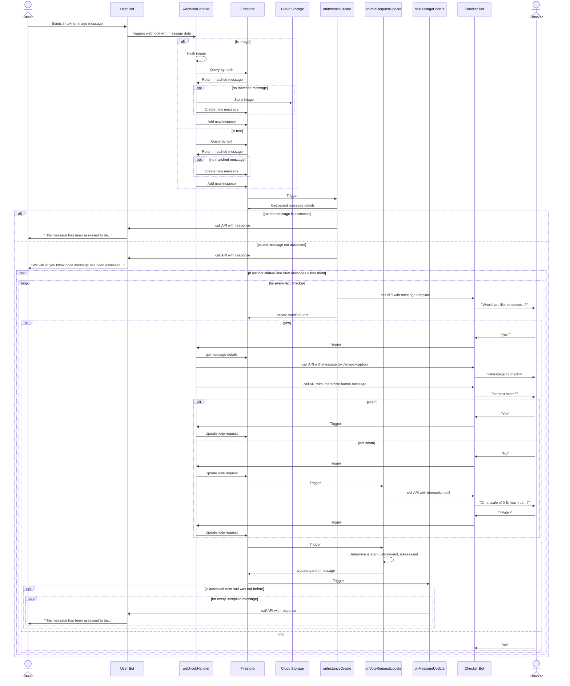

```mermaid
sequenceDiagram
    actor Citizen
    participant User Bot
    participant webhookHandler
    participant Firestore
    participant Cloud Storage
    participant onInstanceCreate
    participant onVoteRequestUpdate
    participant onMessageUpdate
    participant Checker Bot
    actor Checker
    Citizen->>User Bot: Sends in text or image message
    User Bot->>webhookHandler: Triggers webhook with message data
    alt is image
        webhookHandler->>webhookHandler: Hash image
        webhookHandler->>Firestore: Query by hash
        Firestore->>webhookHandler: Return matched message
        opt no matched message
            webhookHandler->> Cloud Storage: Store Image
            webhookHandler->> Firestore: Create new message
        end
        webhookHandler->> Firestore: Add new instance
    else is text
        webhookHandler->>Firestore: Query by text
        Firestore->>webhookHandler: Return matched message
        opt no matched message
            webhookHandler->> Firestore: Create new message
        end
        webhookHandler->> Firestore: Add new instance
    end
    Firestore->> onInstanceCreate: Trigger
    onInstanceCreate->>Firestore: Get parent message details
    alt parent message is assessed
        onInstanceCreate->>User Bot: call API with response
        User Bot->>Citizen: "This message has been assessed to be..."
    else parent message not assessed
        onInstanceCreate->>User Bot: call API with response
        User Bot->>Citizen: "We will let you know once message has been assessed..."
        opt if poll not started and num instances > threshold
            loop for every fact checker
                onInstanceCreate->>Checker Bot: call API with message template
                Checker Bot->>+Checker: "Would you like to assess...?"
                onInstanceCreate->>Firestore: create voteRequest
                alt yes
                    Checker->>Checker Bot: "yes!"
                    Checker Bot->>webhookHandler: Trigger
                    webhookHandler->>Firestore: get message details
                    webhookHandler->>Checker Bot: call API with message text/image+caption
                    Checker Bot->>Checker:"<message to check>"
                    webhookHandler->>Checker Bot: call API with interactive button message
                    Checker Bot->>Checker:"Is this a scam?"
                    alt scam
                        Checker->>Checker Bot: "Yes"
                        Checker Bot->>webhookHandler: Trigger
                        webhookHandler->>Firestore: Update vote request
                    else not scam
                        Checker->>Checker Bot: "No"
                        Checker Bot->>webhookHandler: Trigger
                        webhookHandler->>Firestore: Update vote request
                        Firestore->> onVoteRequestUpdate: Trigger
                        onVoteRequestUpdate->> Checker Bot: call API with interactive poll
                        Checker Bot->>Checker: "On a scale of 0-5, how true...?"
                        Checker->>Checker Bot: "<Vote>"
                        Checker Bot->>webhookHandler: Trigger
                        webhookHandler->>Firestore: Update vote request
                    end
                    Firestore->> onVoteRequestUpdate: Trigger
                    onVoteRequestUpdate->>onVoteRequestUpdate: Determine isScam, isIrrelevant, isAssessed
                    onVoteRequestUpdate->>Firestore: Update parent message
                    Firestore->> onMessageUpdate: Trigger
                    opt is assessed now and was not before
                        loop for every unreplied message
                            onMessageUpdate->>User Bot: call API with response
                            User Bot->>Citizen: "This message has been assessed to be..."
                        end
                    end
                else no
                    Checker->>Checker Bot: "no!"
                end
            end
        end
    end
```
