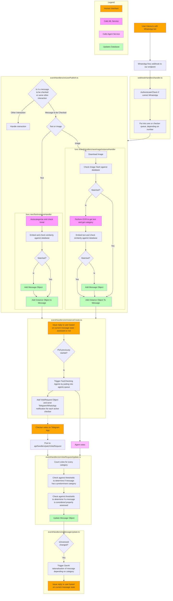

```mermaid
flowchart TB
    classDef human fill:#FFA500
    classDef mlservice fill:#f9f
    classDef agentservice fill:#ffbbff
    classDef dbUpdate fill:#bbffbb
    A[User interacts with WhatsApp bot]:::human
    B[WhatsApp fires webhook to our endpoint]
    subgraph Legend
      Legend1[Human Interface]:::human
      Legend2[Calls ML Service]:::mlservice
      Legend3[Calls Agent Service]:::agentservice
      Legend4[Updates Database]:::dbUpdate
    end
    subgraph webhookHandlers/handler.ts
        C1[Authenticate/Check if correct WhatsApp]
        C2[Put into user or checker queue, depending on number]
        direction TB
    end
    subgraph eventHandlers/onUserPublish.ts
        D1{Is it a message <br> to be checked <br> or some other <br> interaction}
        D2[Handle interaction]
        D3{Text or Image}
        subgraph func newTextInstanceHandler
            D3a1[Autocategorise and check trivial]:::mlservice
            D3a2[Embed and check similarity against database]
            D3a3{Matched?}
            D3a4[Add Message Object]:::dbUpdate
            D3a5[Add Instance Object to Message]:::dbUpdate
            D3a1 --> D3a2
            D3a2 --> D3a3
            D3a3 --No--> D3a4
            D3a4 --> D3a5
            D3a3 --Yes--> D3a5

        end
        subgraph func eventHandlers/newImageInstanceHandler
            D3b1[Download Image]
            D3b2[Check Image Hash against database]
            D3b3{Matched?}
            D3b4[Perform OCR to get text and get category]:::mlservice
            D3b5[Embed text and check similarity against database]
            D3b6{Matched?}
            D3b7[Add Message Object]:::dbUpdate
            D3b8[Add Instance Object To Message]:::dbUpdate
            D3b1 --> D3b2
            D3b2 --> D3b3
            D3b3 --No--> D3b4
            D3b4 --> D3b5
            D3b5 --> D3b6
            D3b6 --No--> D3b7
            D3b6 --Yes--> D3b8
            D3b7 --> D3b8
            D3b3 --Yes--> D3b8
        end
        D1 --Other Interaction--> D2
        D1 --Message to be Checked--> D3
        D3 --Image--> D3b1
        D3 --Text-->D3a1
    end
    subgraph eventHandlers/onInstanceCreate.ts
        direction TB
        E1[Issue reply to user based on current message state - assessed or not]:::human
        E2{Poll previously <br> started?}
        E3[Trigger FactChecking Agents by putting into agents queue]
        E4[Add VoteRequest Object and send Telegram/WhatsApp notification for each active checker]
        E1 --> E2
        E2 --No--> E3
        E3 --> E4
    end
    F[Checker votes on Telegram App]:::human
    F1[Post to api/handlers/patchVoteRequest]
    G[Agent votes]:::agentservice
    subgraph eventHandlers/onVoteRequestUpdate.ts
        direction TB
        H1[Count votes for every category]
        H2[Check against thresholds to determine if message has a predominant category]
        H3[Check against thresholds to determine if a message is considered properly assessed]
        H4[Update Message Object]:::dbUpdate
        H1 --> H2
        H2 --> H3
        H3 --> H4
    end
    subgraph eventHandlers/onMessageUpdate.ts
        direction TB
        I1{isAssessed<br>changed?}
        I2[Trigger GenAI rationalisation of message depending on category]
        I3[Issue reply to user based on current message state]:::human
        I1 --Yes--> I2
        I2 --> I3
    end
    A --> B
    B --> C1
    C1 --> C2
    C2 --> eventHandlers/onUserPublish.ts
    D3a5 --> eventHandlers/onInstanceCreate.ts
    D3b8 --> eventHandlers/onInstanceCreate.ts
    E4 -.-> F
    E3 --> G
    F --> F1
    F1 --> eventHandlers/onVoteRequestUpdate.ts
    G --> eventHandlers/onVoteRequestUpdate.ts
    H4 --> I1
```
